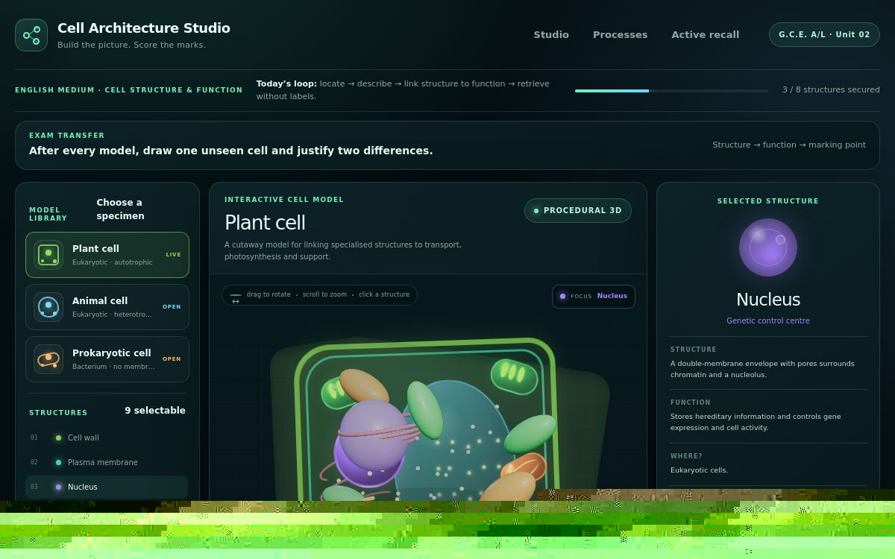

# Cell Architecture Studio

An interactive cell-learning studio for English-medium Sri Lankan G.C.E. A/L Biology. It connects cell structure to biochemical processes, active recall, and exam-ready marking points.

[**Open the live studio**](https://cell-architecture-studio.phenlleyniron.chatgpt.site/) · React · TypeScript · Vinext · Cloudflare Workers



## Learning experience

- Switch between plant, animal, and bacterial cell models
- Inspect organelles with concise structural and functional explanations
- Trace protein secretion, respiration, osmosis, and bacterial protein synthesis
- Hide labels for 90-second active-recall drills
- Compare three cell types using high-value discriminators
- Convert visual exploration into syllabus-aligned exam language

## Run locally

Requirements: Node.js 22.13+ and Linux with `flock`, `curl`, and GNU `timeout`.

```bash
npm run install:ci
npm run dev
```

```bash
npm test
npm run lint
```

## Project map

- `app/CellStudio.tsx` — models, process sequences, recall, and comparison modes
- `app/globals.css` — responsive visual system
- `tests/` — rendered-output contract
- `worker/` — Cloudflare Worker entry point

## Scope

The studio is a revision aid, not a substitute for the current syllabus, teacher guidance, or primary learning materials. Its strongest use is active recall followed by written exam practice.

No licence has been granted yet. The source is public for inspection; reuse rights remain reserved unless a licence is added.
